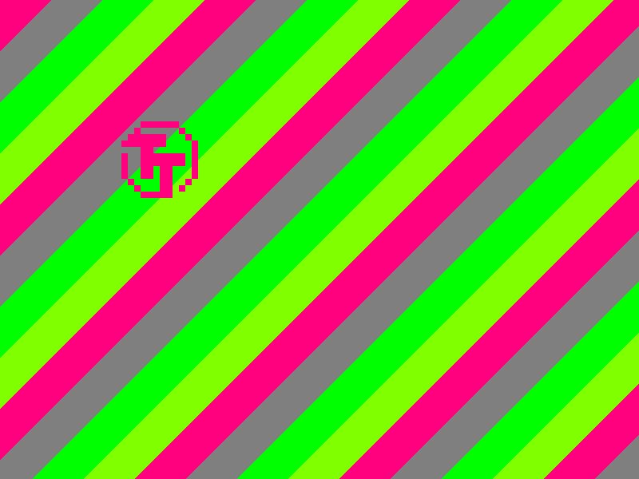
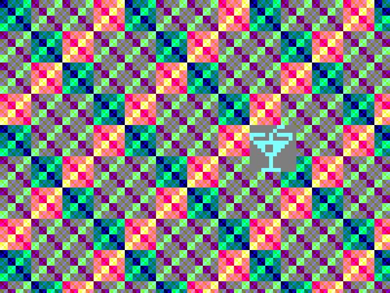
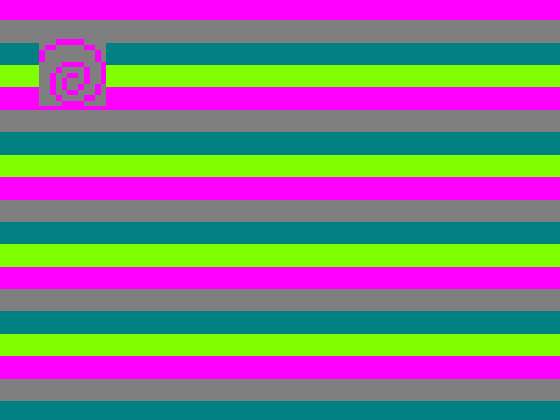

 

# One Sprite Pony

This is a resubmission of [tt05-one-sprite-pony](https://github.com/mole99/tt05-one-sprite-pony) with a few updates.

Some of the notable changes:

- Uses clock gating for the sprite shift register
- Simplified SPI interface
  - `spi_mode` (pin `ui[0]`) to select between writing to the registers (`0`) or shifting new data into the sprite (`1`)
  - Uses latches for the configuration registers
- Assign new sprite positions only on new line
- Clamp x and y position to prevent uncontrolled shifting of the sprite data

Quick summary of the features:

- SVGA 800x600@60 Hz (pixel clock 40.0 MHz), 2 bits per color channel
- Internal resolution of 100x75 for the sprite
- Sprite with 12x12 pixel
  - Initialized to the Tiny Tapeout logo
  - Foreground and background color
  - Background can be set transparent
- 4 different colors (6 bit rrggbb)
- 4 different backgrounds
	- Solid color
	- Funky
	- Diagonal stripes
	- Horizontal Stripes
- SPI receiver
	- Set sprite data
	- Set colors (1-4)
	- Set background (4 types)
	- Set sprite x/y position
	- Set miscellaneous options

|   |   |
|---|---|
|   |   |
|   |   |

## SPI Register

SPI Settings

	CPOL       = 0
	CPHA       = 1
	word width = 8
	MSB first
	CS is active low

### Register Map

For `spi_mode` **high**:

In this mode the data gets shifted directly into the sprite for as long as CS asserted. It is possible to shift in single bits.

For `spi_mode` **low**:

Expects an address byte first followed by the value to write into the register. The word width must be 8 bits.

| Addr Hex | Name | Type | Reset Value | Description |
|----------|------|------|-------------|-------------|
| 0x00     | COLOR1     | R/W     | 6'b110001            | 6 bit color in format RRGGBB used as sprite foreground            |
| 0x01     | COLOR2     | R/W     | 6'b010101            | 6 bit color in format RRGGBB used as sprite background            |
| 0x02     | COLOR3     | R/W     | 6'b001100            | 6 bit color in format RRGGBB used as solid color background           |
| 0x03     | COLOR4     | R/W     | 6'b101100            | 6 bit color in format RRGGBB            |
| 0x04     | SPRITE_X     | R/W     | 6'b000000            | 6 bit x position of the sprite            |
| 0x05     | SPRITE_Y     | R/W     | 6'b000000            | 6 bit y position of the sprite            |
| 0x06     | MISC     | R/W     | 4'b0110            | Various Settings, see below            |

Details for MISC Register:

- Bits 1:0: Background selection
	- 00: Solid color
	- 01: Funky
	- 10: Diagonal Stripes
	- 11: Horizontal Stripes

	New background type is assigned at hsync to prevent glitching
- Bit 2: Enable movement of the sprite
- Bit 3: Enable sprite background (transparency)

Backgrounds:

- Background type 1 uses COLOR3 as solid color.
- Background type 2 calculates the color based on the screen coordinates.
- Background types 3 to 4 (stripes) use all four colors for the stripes.

For background types 2 to 4, the current time is used to vary the background.

## Notes

I have some problems with the latches in the GL simulation. We will see if they keep their initialization values. If not, it should be possible to manually write the initialization values to the registers.